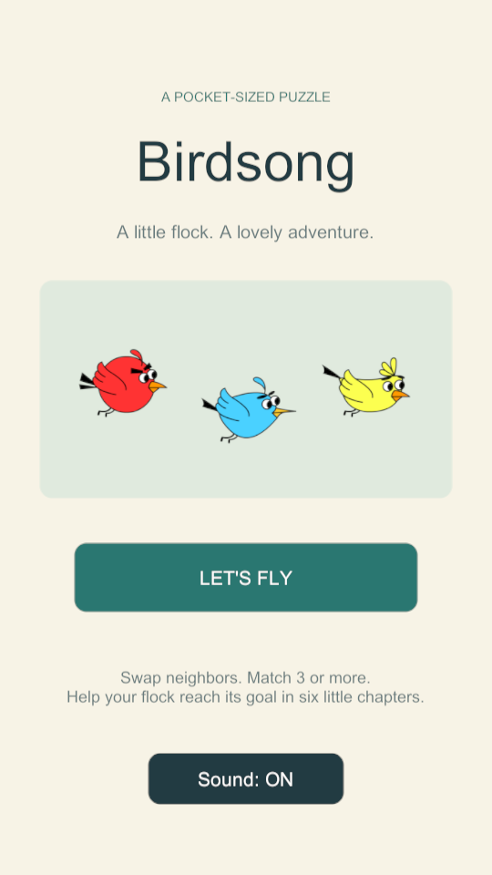
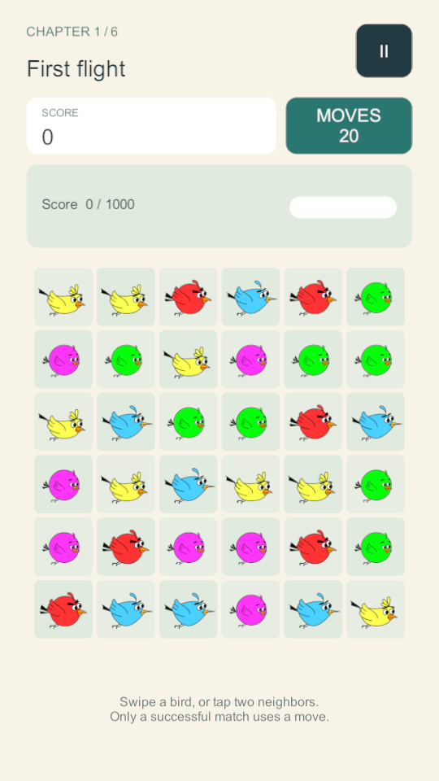

# Birdsong

Kuş temalı, altı bölümlük bir mobil Match-3 oyunu. Mevcut Unity prototipinin board, kuş prefab'ları ve animasyonları üzerinde geliştirilmiştir. Reklam, hesap, analytics, satın alma veya sunucu bağlantısı içermez.

 

Doğrulama: **26 EditMode + 10 PlayMode testi geçti**, Windows x64 development build başarılı. Fiziksel Android cihaz testi henüz yapılmadı.

Ses güncellemesi ayrıca hedefli PlayMode testinden geçti: sekiz clip'in bağlı ve ses içerdiği, OFF'un aktif/yeni sesleri durdurduğu, ON'un yeniden çaldığı ve tercihin kaydedildiği doğrulandı.

## Çalıştırma

1. Unity Hub üzerinden bu repository'nin kökünü açın: `like-candy-crash`.
2. **Unity 2022.3.62f1** kullanın; paketlerin import edilmesini bekleyin.
3. `Assets/2DBirds_Pack3/Scenes/MainScene.unity` scene'ini açıp Play'e basın.
4. **Let's fly → Level 1** ile başlayın.

Build listesi aynı `MainScene` ile başlar. Eski `Assets/Scenes/SampleScene.unity` korunmuştur fakat yalnızca kamera içerir; oyunun başlangıç scene'i değildir. `Birdsong/Configure V1 Scene` menüsü mevcut scene'in V1 referanslarını tekrar kurabilir; normal kullanım için gerekli değildir ve scene'i kaydeder.

Güncel sesli Windows paketi `Build/Birdsong-Windows-Audio.zip` altındadır: eski oyunu kapatın, ZIP'in tamamını çıkarıp yeni `Birdsong.exe` dosyasını çalıştırın. `Birdsong_Data` ve diğer yan dosyalar executable ile aynı klasörde kalmalıdır. Build çıktıları Git'e dahil edilmez. Yeniden üretmek için `Birdsong/Build Windows Development` menüsünü kullanın.

## Oynanış ve kontroller

- Yan yana iki kuşu sürükleyerek değiştirin veya sırayla iki komşuya dokunun/tıklayın.
- Aynı **kuş türü ve renk** çiftinden en az üçü yatay/dikey eşleşir.
- Geçersiz değişim animasyonla geri alınır; hamle harcanmaz.
- Geçerli değişim bir hamle harcar. Eşleşmeler kalkar, kuşlar düşer, boşluklar dolar ve cascade zinciri tamamlanır.
- Başlangıçta eşleşme yoktur ve en az bir hamle vardır. Hamle kalmayan board ücretsiz karıştırılır.
- Hedefler tamamlandığında kazanılır; son hamlenin bütün cascade'leri değerlendirilmeden kayıp kararı verilmez.
- Pause düğmesi veya Escape ile duraklatın. Uygulama odağını kaybedince oyun duraklar; Resume ile devam eder.

Mouse ve tek parmaklı touch desteklenir. Hareket, çözülme, menü, pause ve sonuç ekranları sırasında board input'u kilitlidir.

## Altı bölüm

Tüm değerler `Assets/Resources/Campaign.json` içinde düzenlenir; level başına ayrı gameplay script'i yoktur.

| Bölüm | Hedef | Hamle |
| --- | --- | --- |
| 1 — First flight | 1.000 puan | 20 |
| 2 — Finding a rhythm | 2.000 puan | 22 |
| 3 — Blue skies | 15 mavi kuş | 22 |
| 4 — Sunrise chorus | 12 kırmızı + 12 sarı kuş | 22 |
| 5 — Soaring higher | 4.000 puan | 18 |
| 6 — The grand migration | 5.000 puan + 15 mavi + 15 sarı kuş | 22 |

Level 1 açık başlar. Kazanılan bölüm bir sonrakini açar; tamamlananlar yeniden oynanabilir. Level 6 sonunda kampanya tamamlanır; Level 7 oluşturulmaz.

## Skor, hedefler ve kayıt

3 kuş 100, 4 kuş 200, 5 kuş 300; daha büyük gruplarda her ek kuş 100 puandır. Ayrı eşleşmeler ayrı puanlanır; kesişen çizgiler tek grup sayılır ve kuşlar çift toplanmaz. Aynı oyuncu hamlesindeki çözülmeler x1, x2, x3… çarpanı alır. Skor ayarları da `Campaign.json` içindedir.

Score, renk toplama ve bunların çoklu kombinasyonları desteklenir. Eşleşme kimliği ile toplama rengi ayrı tutulur. Kullanılan asset renkleri: kırmızı `0`, pembe `1`, mavi `2`, sarı `5`, yeşil `7`.

PlayerPrefs; açılan en yüksek bölüm, altı bölümün tamamlanma durumu, best score ve ses tercihini saklar. Kayıt şeması doğrulanır; son geçerli sürüm yedeklenir. Okunamayan veri sessizce sıfırlanmaz: yedek kurtarılır veya orijinal korunarak geçici oyun açılır ve kullanıcıya bilgi verilir. Devam eden board kaydedilmez; uygulama yeniden açıldığında level yeniden başlar.

Development reset: Play Mode'da `Birdsong` GameObject'indeki `GameController` component menüsünden **Development/Reset Birdsong Progress**. Yalnızca bu oyunun kayıt anahtarlarını temizler, ses tercihini korur; production arayüzünde yoktur.

## Mimari

| Parça | Sorumluluk |
| --- | --- |
| `BoardManager` | Mevcut 6×6 GameObject grid, tek swap/resolve coroutine akışı, collapse/refill, bounded reshuffle ve merkezi `GameState` |
| `Bird` | Mevcut kuş kimliği, hareket/düşme eğrileri ve uçuş animasyonu; olmayan Fly trigger için güvenli fallback |
| `InputManager` | Touch/mouse seçimi ve komşu swap isteği; grid'i veya kuş koordinatlarını değiştirmez |
| `MatchRules` | Unity nesnelerinden bağımsız eşleşme, hamle arama, başlangıç üretimi, shuffle ve collapse kuralları |
| `Campaign` / `LevelSession` | Level verisi doğrulama, skor/hamle ve objective ilerlemesi |
| `ProgressStore` | Sürümlü kayıt, doğrulama, yedek/kurtarma; testler için değiştirilebilir storage arayüzü |
| `GameController` | Menü/level/result akışı, olay abonelikleri ve pause yaşam döngüsü |
| `GameUI` | UGUI CanvasScaler, safe area, responsive board framing, HUD, menüler ve hafif puan feedback'i |
| `GameAudio` | Selection/swap/match/invalid/cascade/win/lose/button efektleri; anında mute/stop ve güvenli eksik clip desteği |

Akış: Main Menu → Level Select → Gameplay → Win/Lose → Next / Replay / Level Select. Ekranlar aynı mevcut gameplay scene'inde panellerle yönetilir. Mevcut kuş prefab'ları ve animasyonlar korunmuştur; ayrı level scene'leri üretilmemiştir.

Shuffle önce 64 sınırlı permütasyon dener. Bu yeterli değilse güvenli board yeniden üretilir; son çare başlangıç düzeni matematiksel olarak geçerli hamle içerir. Yeniden üretim kuş dağılımını korumak zorunda değildir; puan/hamle vermez. Cascade başına 100 çözülme güvenlik sınırı da ücretsiz yenileme yapar.

## Proje yapısı ve teknolojiler

```text
Assets/
  2DBirds_Pack3/      # Korunan sprite, prefab, animator, scene ve dört özgün script
  Birdsong/
    Runtime/         # Oyun akışı, saf kurallar, kayıt, audio, UGUI
    Editor/          # Scene bağlantısı ve development build aracı
    Tests/           # EditMode, PlayMode ve görsel önizleme testleri
  Resources/Campaign.json
Packages/            # Unity UGUI ve mevcut Unity Test Framework dahil
ProjectSettings/     # Unity sürümü, portrait ve build başlangıç scene'i
docs/                # İnceleme ve QA notları
```

Unity/C#, Coroutine, SpriteRenderer/Animator, Physics2D, legacy Input (mouse + touch), UGUI ve Unity Test Framework kullanılır. Runtime ve Editor/test assembly'leri ayrıdır. İçe aktarılan projedeki kullanılmayan Ads/Analytics/Purchasing paketleri kaldırılmıştır.

## Test ve QA

**Window → General → Test Runner** üzerinden EditMode ve PlayMode testlerini çalıştırın. Gerçekleştirilen kontroller ve sınırlar için [QA raporuna](docs/QA.md) bakın.

Komut satırı örneği (Unity executable yolunu kendi kurulumunuza göre değiştirin):

```powershell
& $Unity -batchmode -nographics -projectPath $Project -runTests -testPlatform EditMode -testResults "$Project/TestResults/EditMode.xml" -logFile "$Project/TestResults/EditMode.log"
& $Unity -batchmode -nographics -projectPath $Project -runTests -testPlatform PlayMode -testResults "$Project/TestResults/PlayMode.xml" -logFile "$Project/TestResults/PlayMode.log"
```

Görsel önizleme testi için `-nographics` parametresini çıkarın ve `-testFilter VisualPreviewTests` ekleyin. Görüntüler `TestResults/Previews` altına yazılır. Görsel test yalnızca panelleri render eder; gerçek kazanma/kaybetme akışı ayrı PlayMode testlerinde sınanır. Kural testleri 1.000 başlangıç board'u, fallback/shuffle, skor, objective, kayıt ve altı bölüm simülasyonunu kapsar.

## Android hazırlığı ve V1 sınırları

Portrait yönü, safe area, touch input ve pause/resume akışı hazırdır. Android için ARM64/IL2CPP ayarlanmıştır. Paket kimliği **`com.example.birdsong` bir placeholder'dır**; yayın öncesi size ait benzersiz kimlik seçilmelidir. İmzalama anahtarı veya gizli veri repository'ye eklenmez. Unity Hub'dan Android Build Support/SDK/NDK/OpenJDK modülleriyle cihaz build'i alın; target SDK ve mağaza gerekliliklerini yayın tarihinde ayrıca doğrulayın.

Sekiz özgün, sentezlenmiş ses efekti `Assets/Birdsong/Audio` altında bulunur ve `MainScene → Birdsong → GameAudio` alanlarına bağlıdır: seçim, swap, match, geçersiz swap, cascade, win, lose ve UI düğmesi. **Sound OFF** aktif efektleri hemen keser ve yeni efektleri engeller; **Sound ON** kısa bir düğme sesiyle geri bildirim verir. Tercih kaydedilir. Arka plan müziği yoktur. Sesler üçüncü taraf kayıt/sample kullanmadan `tools/generate_sfx.py` ile yeniden üretilebilir; clip eksik olduğunda güvenli sessiz davranış korunur.

V1'de özel kuş/power-up, engel, reklam, analytics, IAP, cloud save, kullanıcı hesabı veya multiplayer yoktur. Gerçek Android cihaz testi ve insanlarla zorluk/erişilebilirlik değerlendirmesi, otomatik testlerden ayrı yapılmalıdır.

## Asset kaynağı

Mevcut projedeki **2D Birds Pack3 — SR Studios Kerala** sprite/prefab/animasyonları ve orijinal Readme korunmuştur. Paket belgeleri açık bir yeniden dağıtım lisansı içermediğinden bu çalışma asset'lere yeni bir lisans vermez. Herkese açık GitHub paylaşımı ve mağaza dağıtımı öncesi mevcut asset kullanım/yeniden dağıtım hakkını kontrol edin. Candy Crush marka, görsel, ses veya karakterleri eklenmemiştir.

## Sonraki geliştirmeler

Kullanıcının sonraki prompt için belirttiği kuş sesi, farklı hayvan temaları ve **Animal Crash** isim fikri [çalışma notlarında](docs/ROADMAP.md) saklanmıştır. Bunlar bu sürümde uygulanmamıştır.

Gerçek cihaz playtest'ine göre level dengesi; arka plan müziği; renk körlüğü ve erişilebilirlik seçenekleri; özel eşleşme kuşları; devam eden level kaydı; daha büyük içerik seti. Bunlar mevcut V1'de uygulanmış özellikler değildir.
